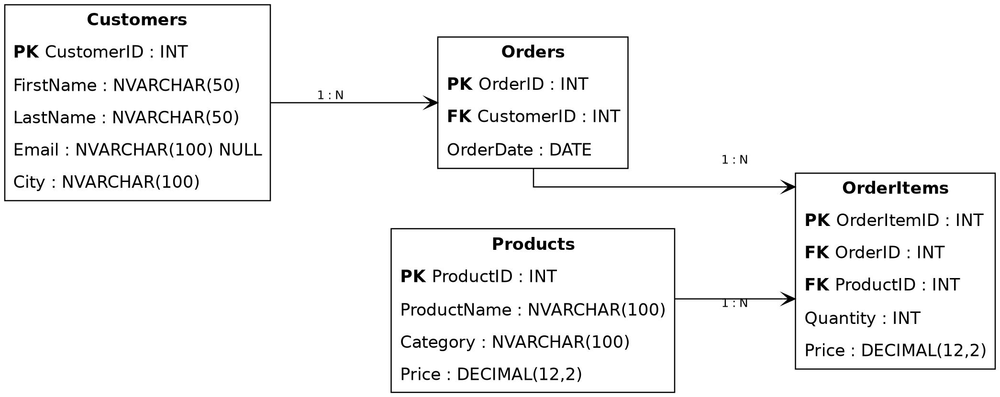
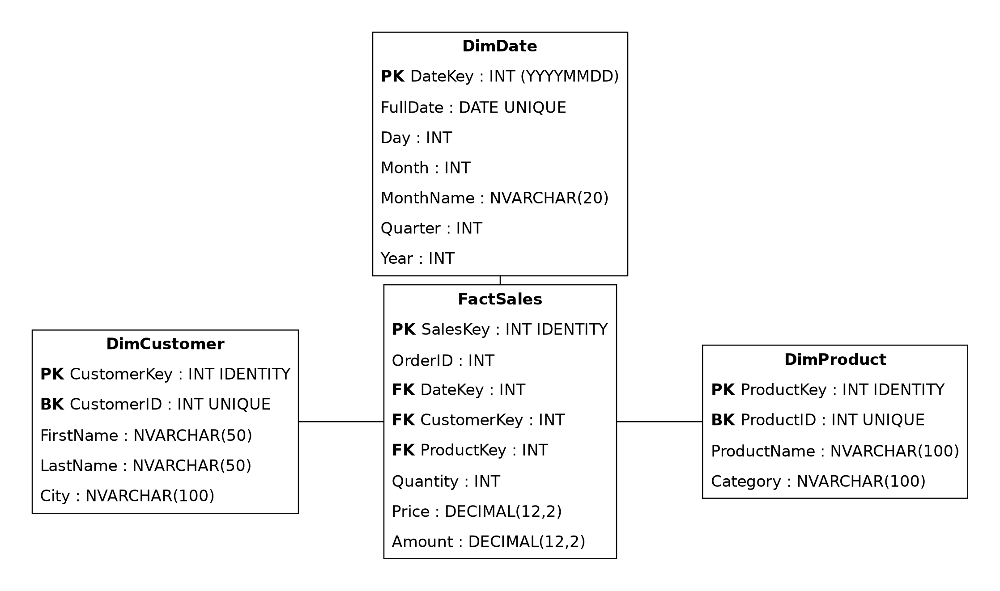

# Практическая работа №1 — TechStore

**Дисциплина:** Технология разработки и защиты баз данных  
**Тема:** OLTP → DWH → ручной ETL → аналитика  
**СУБД:** Microsoft SQL Server

Этот репозиторий содержит вспомогательные материалы к первой практической работе по сквозному проекту **TechStore**.

> Основное задание и спецификация таблиц находятся в Word-документе практической работы.  
> Этот README нужен как краткая теория, карта работы и справочник по SQL-механикам.

---

## Файлы

```text
.
├── README.md
├── Лаба 1 - ETL.docx
├── seed.sql
└── images/
    ├── TechStore_OLTP.png
    └── TechStore_DWH.png
```

- `Лаба 1 - ETL.docx` - документ с указаниями по Практической работе 1
- `seed.sql` — фиксированный набор исходных данных. **Не изменять**, если преподаватель не сказал обратное.
- `images/TechStore_OLTP.png` — схема операционной базы.
- `images/TechStore_DWH.png` — схема аналитического хранилища.

---

# 1. Общая архитектура

В работе используются две базы:

```text
TechStore
   OLTP
    |
    | ETL
    v
TechStore_DWH
    DWH
    |
    v
аналитические запросы
```

Корректная терминология:

- **OLTP** — операционная обработка текущих транзакций;
- **DWH** — хранилище данных, подготовленное для аналитики;
- **OLAP** — аналитическая обработка данных, которая может выполняться поверх DWH;
- **ETL** — процесс извлечения, преобразования и загрузки данных.

---

# 2. OLTP: база TechStore



В операционной базе находятся:

```text
Customers
Products
Orders
OrderItems
```

Связи:

```text
Customers 1 ─── N Orders
Orders    1 ─── N OrderItems
Products  1 ─── N OrderItems
```

### IDENTITY в OLTP

В данной работе поля `CustomerID`, `ProductID`, `OrderID` и `OrderItemID`
являются первичными ключами (`PRIMARY KEY`) и настраиваются как `IDENTITY`.

При обычной вставке SQL Server генерирует значения `IDENTITY` автоматически.
Однако `seed.sql` содержит фиксированные значения ID, поэтому для их явной
вставки можно использовать:

```sql
SET IDENTITY_INSERT TableName ON;

-- INSERT ...

SET IDENTITY_INSERT TableName OFF;
```
В одной сессии SQL Server `IDENTITY_INSERT` может быть включён (`ON`) одновременно только для одной таблицы. Перед включением для другой таблицы необходимо выполнить `OFF` для предыдущей.


### Почему `Price` есть и в Products, и в OrderItems

`Products.Price` — **текущая цена каталога**.

`OrderItems.Price` — **историческая цена конкретной покупки**.

Если завтра цена товара изменится, старый заказ не должен пересчитаться. Поэтому историческую выручку необходимо считать по `OrderItems.Price`.

---

# 3. DWH: база TechStore_DWH



В аналитическом хранилище находятся:

```text
DimCustomer
DimProduct
DimDate
FactSales
```

Это учебная схема типа **«звезда»**.

```text
             DimDate
                |
DimCustomer — FactSales — DimProduct
```

---

# 4. Fact и Dimension

## Dimension

**Dimension (измерение)** описывает контекст события.

Примеры:

- `DimCustomer` — кто купил;
- `DimProduct` — что купили;
- `DimDate` — когда купили.

Измерения позволяют группировать и фильтровать показатели.

## Fact

**FactSales** содержит события продаж и числовые показатели:

```text
Quantity
Price
Amount
```

### Гранулярность

**Гранулярность (grain)** — смысл одной строки таблицы фактов.

В этой работе:

> **Одна строка `FactSales` соответствует одной строке `OrderItems`, то есть одной товарной позиции одного заказа.**

Поэтому после корректного полного ETL число строк `FactSales` должно совпадать с числом строк `OrderItems`.

---

# 5. Business key и surrogate key

## Business key

Ключ, который пришёл из исходной бизнес-системы.

Примеры:

```text
Customers.CustomerID
Products.ProductID
```

## Surrogate key

Внутренний технический ключ DWH.

Примеры:

```text
DimCustomer.CustomerKey
DimProduct.ProductKey
FactSales.SalesKey
```

В SQL Server такие ключи в работе создаются через:

```sql
IDENTITY(1,1)
```

Например:

```sql
CustomerKey INT IDENTITY(1,1) PRIMARY KEY
```

`IDENTITY(1,1)` означает: начать с 1 и увеличивать значение на 1.

### Важный момент

Если после первого чистого запуска:

```text
CustomerID = 1
CustomerKey = 1
```

это **не означает**, что ключи одинаковы по смыслу.

При ETL нужно искать строку измерения по business key и получать её surrogate key:

```text
Orders.CustomerID
        ↓
DimCustomer.CustomerID
        ↓
DimCustomer.CustomerKey
```

---

# 6. Что такое ETL

**ETL = Extract → Transform → Load**

## Extract

Получить данные из источника.

```sql
SELECT
    CustomerID,
    FirstName,
    LastName,
    City
FROM TechStore.dbo.Customers;
```

## Transform

Изменить данные перед загрузкой.

Примеры:

- очистить строку;
- преобразовать тип;
- вычислить новое поле;
- получить составной аналитический ключ;
- найти surrogate key;
- убрать дубли;
- выбрать только необходимые поля.

Пример:

```sql
SELECT
    CustomerID,
    TRIM(FirstName) AS FirstName,
    TRIM(LastName) AS LastName,
    TRIM(City) AS City
FROM TechStore.dbo.Customers;
```

Пример вычисляемого показателя:

```sql
Quantity * Price AS Amount
```

## Load

Загрузить подготовленные данные в целевую таблицу.

```sql
INSERT INTO TechStore_DWH.dbo.DimCustomer
    (CustomerID, FirstName, LastName, City)
SELECT
    CustomerID,
    FirstName,
    LastName,
    City
FROM TechStore.dbo.Customers;
```

В простом учебном ETL одна конструкция `INSERT INTO ... SELECT` может одновременно реализовывать Extract, Transform и Load.

---

# 7. `SELECT INTO`

`SELECT INTO` создаёт новую таблицу по результату запроса и сразу помещает в неё данные.

```sql
SELECT
    CustomerID,
    FirstName,
    LastName
INTO #CustomerStage
FROM TechStore.dbo.Customers;
```

Предварительный `CREATE TABLE #CustomerStage` здесь не требуется.

Это удобно для временных и промежуточных наборов данных.

---

# 8. `INSERT INTO ... SELECT`

Если целевая таблица уже существует:

```sql
INSERT INTO TechStore_DWH.dbo.DimProduct
    (ProductID, ProductName, Category)
SELECT
    ProductID,
    ProductName,
    Category
FROM TechStore.dbo.Products;
```

Разница:

```text
SELECT INTO
→ создаёт новую таблицу и заполняет её

INSERT INTO ... SELECT
→ заполняет уже существующую таблицу
```

Для готовых таблиц DWH чаще используется второй вариант.

---

# 9. Временные таблицы

Локальная временная таблица в SQL Server начинается с `#`.

```sql
SELECT *
INTO #TempCustomers
FROM TechStore.dbo.Customers;
```

Проверить:

```sql
SELECT *
FROM #TempCustomers;
```

Удалить:

```sql
DROP TABLE #TempCustomers;
```

Безопасный вариант:

```sql
DROP TABLE IF EXISTS #TempCustomers;
```

Локальные временные таблицы физически создаются SQL Server в системной базе `tempdb` и обычно существуют в рамках текущей сессии.

Временная таблица может использоваться как простой **staging**-слой.

---

# 10. Staging

**Staging area** — промежуточная область между источником и целевой системой.

```text
Source
  ↓
Staging
  ↓
DWH
```

В staging можно:

- проверить данные;
- удалить лишние пробелы;
- преобразовать типы;
- найти ошибки;
- подготовить данные к загрузке.

Для небольшой работы staging не является обязательным: ETL можно выполнить напрямую через `INSERT INTO ... SELECT`.

---

# 11. Порядок загрузки

Таблицы измерений должны быть загружены раньше таблицы фактов:

```text
1. DimCustomer
2. DimProduct
3. DimDate
4. FactSales
```

Причина:

`FactSales` должна получить существующие:

```text
CustomerKey
ProductKey
DateKey
```

из таблиц измерений.

---

# 12. Lookup через JOIN

При создании факта данные собираются из нескольких мест.

Например, чтобы получить `CustomerKey`:

```sql
JOIN TechStore_DWH.dbo.DimCustomer AS dc
    ON dc.CustomerID = o.CustomerID
```

После этого в результирующем `SELECT` можно использовать:

```sql
dc.CustomerKey
```

Для товара аналогично:

```sql
JOIN TechStore_DWH.dbo.DimProduct AS dp
    ON dp.ProductID = oi.ProductID
```

---

# 13. Сначала `SELECT`, потом `INSERT`

Для сложной загрузки сначала соберите и проверьте будущие строки:

```sql
SELECT
    ...
FROM ...
JOIN ...
```

Проверьте:

- количество строк;
- ключи;
- даты;
- `Quantity`;
- `Price`;
- вычисленный `Amount`.

И только после этого добавляйте:

```sql
INSERT INTO ...
SELECT ...
```

Так ошибку проще найти до изменения целевой таблицы.

---

# 14. Работа с датами в SQL Server

Пусть имеется:

```text
2026-09-11
```

Для DWH может понадобиться ключ:

```text
20260911
```

## `CAST`

Приведение к другому типу:

```sql
CAST(OrderDate AS DATE)
```

Общая форма:

```sql
CAST(выражение AS тип)
```

## `CONVERT`

SQL Server позволяет дополнительно указывать стиль преобразования.

```sql
CONVERT(DATE, OrderDate)
```

Стиль `112` представляет дату как:

```text
yyyymmdd
```

Поэтому удобный вариант `DateKey`:

```sql
CONVERT(
    INT,
    CONVERT(CHAR(8), OrderDate, 112)
)
```

Для:

```text
2026-09-11
```

получится:

```text
20260911
```

## Вариант через `FORMAT`

```sql
CAST(FORMAT(OrderDate, 'yyyyMMdd') AS INT)
```

Он хорошо читается, но для больших объёмов данных обычно тяжелее, чем `CONVERT`.

## Части даты

```sql
YEAR(OrderDate)
MONTH(OrderDate)
DAY(OrderDate)
```

Например:

```text
2026-09-11

YEAR  = 2026
MONTH = 9
DAY   = 11
```

## `DATEPART`

```sql
DATEPART(QUARTER, OrderDate)
```

Для сентября результат:

```text
3
```

## `DATENAME`

```sql
DATENAME(MONTH, OrderDate)
```

возвращает название месяца, зависящее от языковых настроек сессии SQL Server.

Если нужно явно получить русское название:

```sql
FORMAT(OrderDate, N'MMMM', 'ru-RU')
```

> Как именно сформировать и загрузить все строки `DimDate` — часть практического задания.

---

# 15. Контроль исходных данных

После запуска `seed.sql` должны получиться **строго эти значения**:

| Таблица | Строк |
|---|---:|
| `Customers` | 10 |
| `Products` | 15 |
| `Orders` | 20 |
| `OrderItems` | 43 |

Контроль:

```sql
SELECT 'Customers' AS TableName, COUNT(*) AS RowCount FROM dbo.Customers
UNION ALL SELECT 'Products', COUNT(*) FROM dbo.Products
UNION ALL SELECT 'Orders', COUNT(*) FROM dbo.Orders
UNION ALL SELECT 'OrderItems', COUNT(*) FROM dbo.OrderItems;
```

Дополнительно:

```sql
SELECT
    SUM(Quantity) AS TotalUnits,
    SUM(CAST(Quantity AS DECIMAL(18,2)) * Price) AS TotalRevenue
FROM dbo.OrderItems;
```

Ожидается:

```text
TotalUnits   = 49
TotalRevenue = 1914000.00
```

---

# 16. Контроль после ETL

После корректной полной загрузки DWH:

| Таблица / показатель | Ожидается |
|---|---:|
| `DimCustomer` | 10 строк |
| `DimProduct` | 15 строк |
| `DimDate` | 20 строк |
| `FactSales` | 43 строки |
| `SUM(Quantity)` | 49 |
| `SUM(Amount)` | 1 914 000.00 |

Если `FactSales = 86`, наиболее вероятная причина — полный ETL таблицы фактов был запущен два раза.

Не переходите к аналитике, пока контрольные значения не совпадают.

---

# 17. Аналитическая часть

После ETL аналитические задания выполняются **только по `TechStore_DWH`**.

В работе требуется получить:

1. товары, количество проданных единиц и выручку;
2. выручку по категориям;
3. общую сумму покупок клиентов;
4. выручку по годам и месяцам.

Основные механики:

```sql
JOIN
GROUP BY
SUM
ORDER BY
```

Не используйте текущую `Products.Price` для пересчёта исторической выручки. В факте используется цена состоявшейся покупки из `OrderItems.Price`.

---

# 18. Перед сдачей

Проверьте:

- `seed.sql` не изменён;
- обе базы имеют требуемую структуру;
- ETL выполняется в правильном порядке;
- `FactSales` содержит 43 строки;
- всего продано 49 физических единиц;
- общая выручка равна `1 914 000.00`;
- аналитические запросы работают по `TechStore_DWH`;

